# Box-d-Ball

#Screenshots:
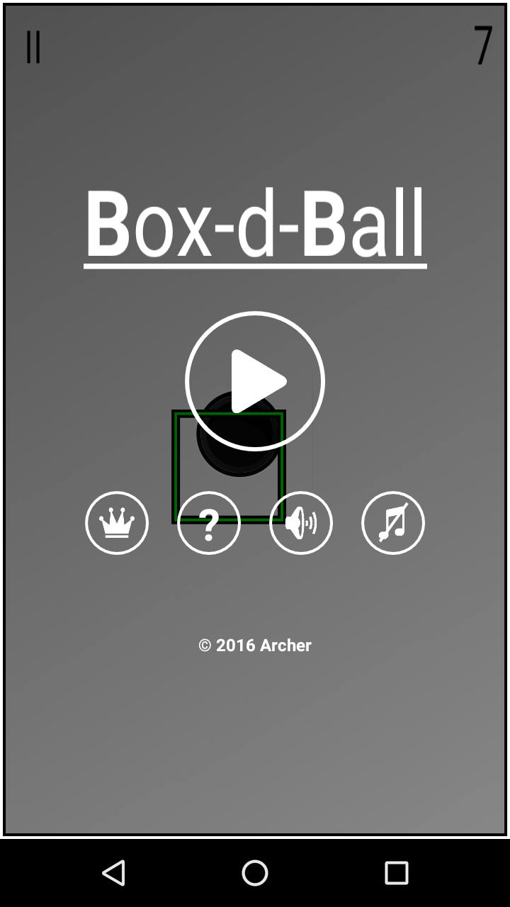
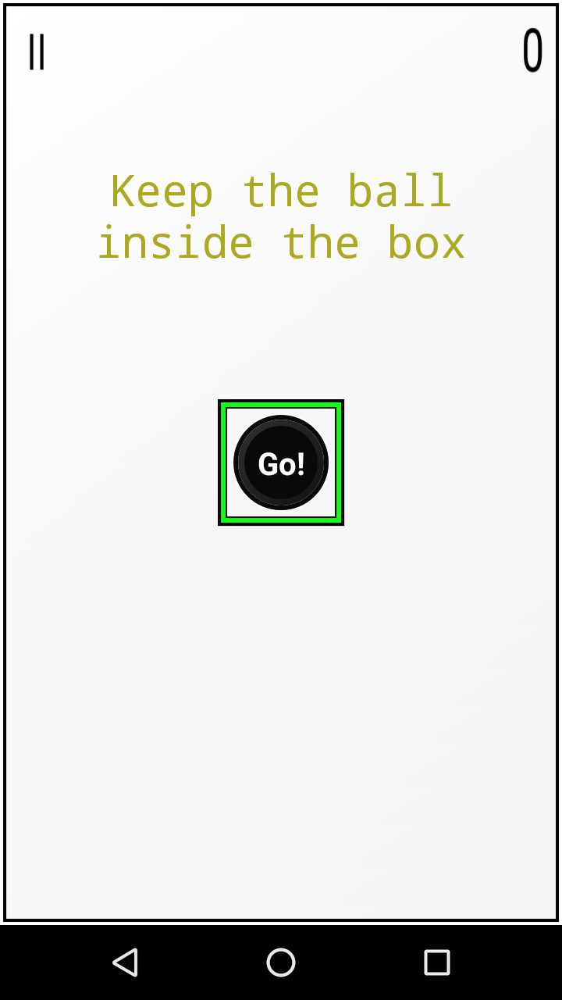
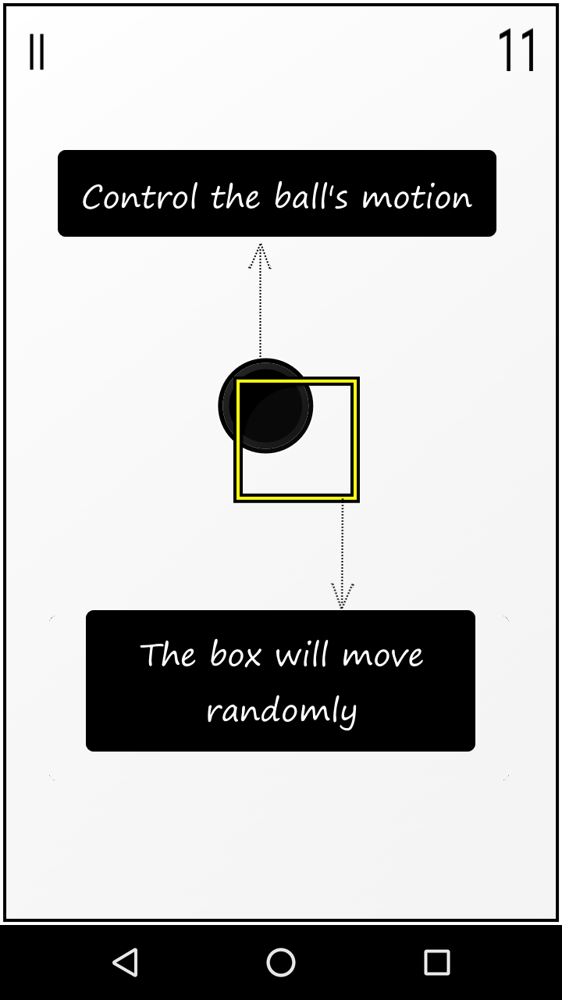
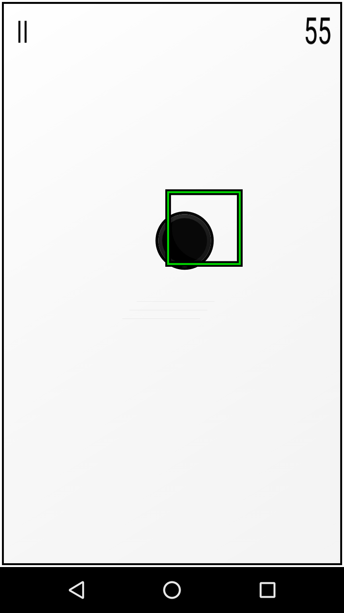
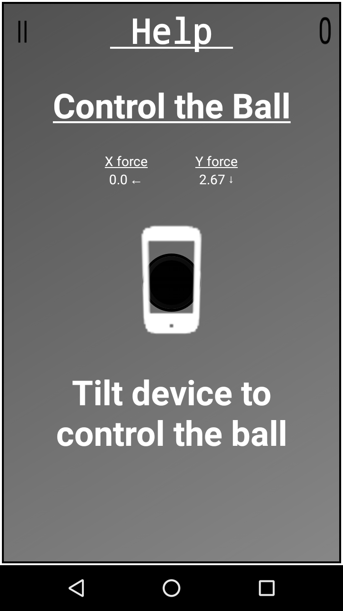
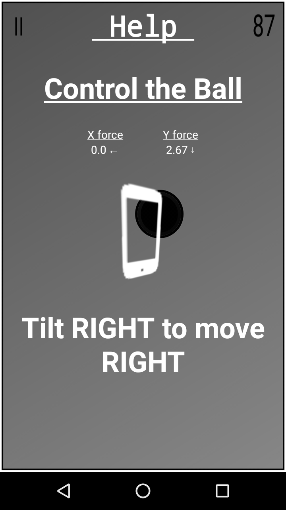
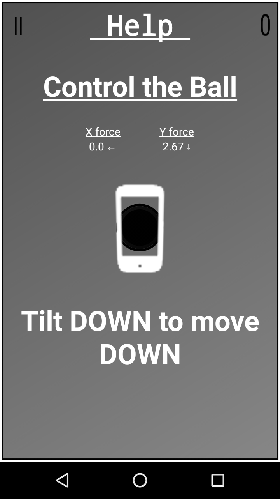
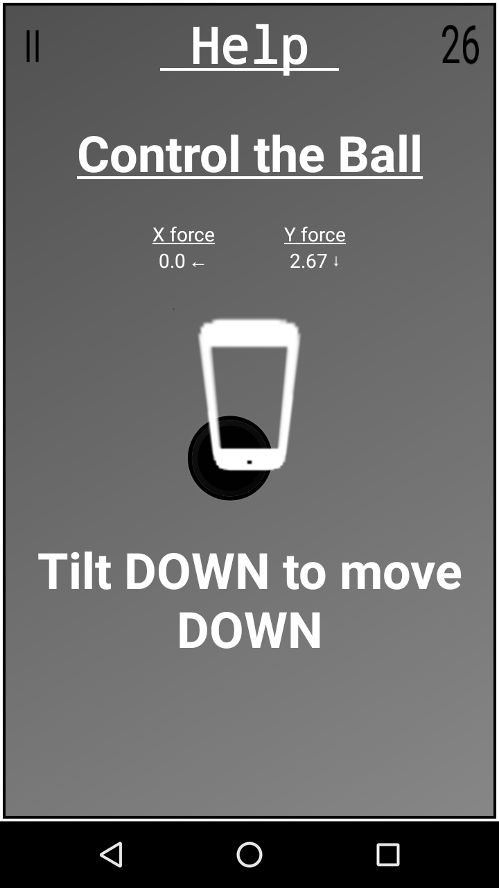
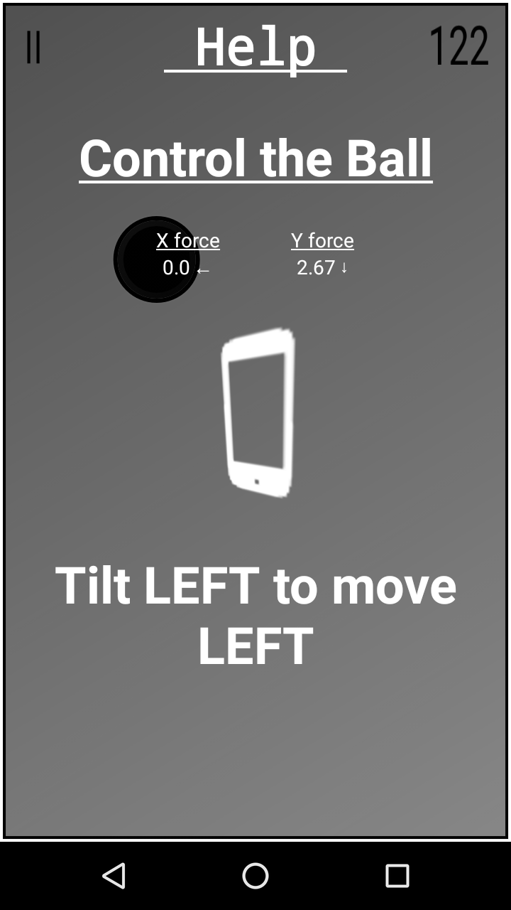
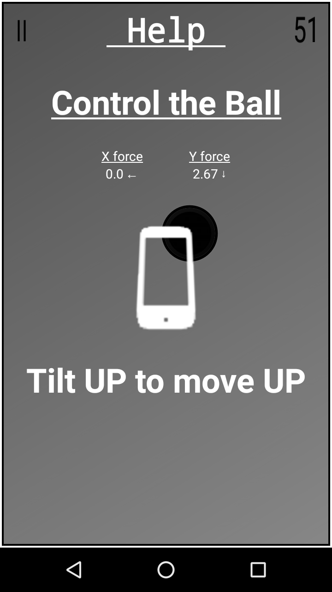
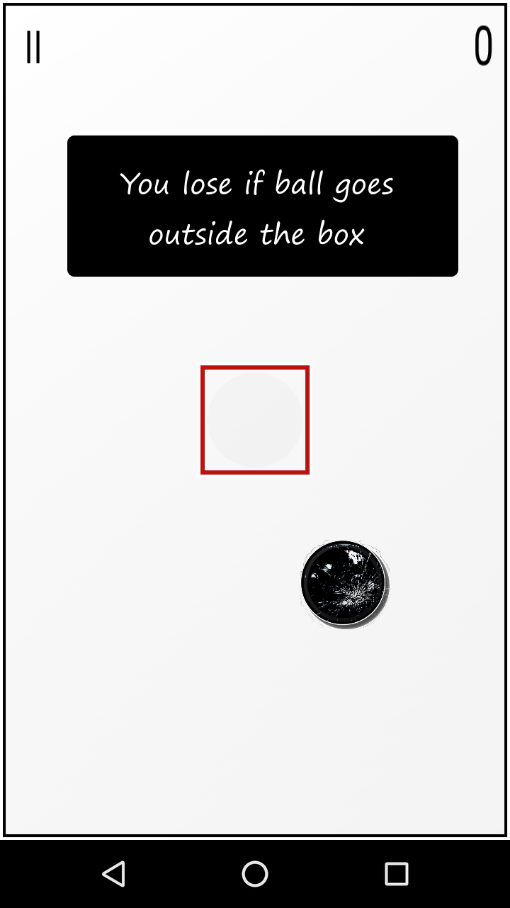
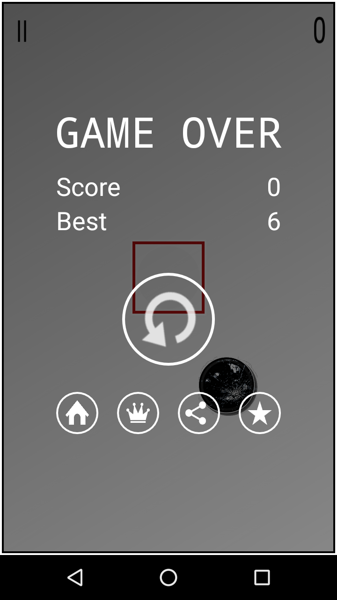
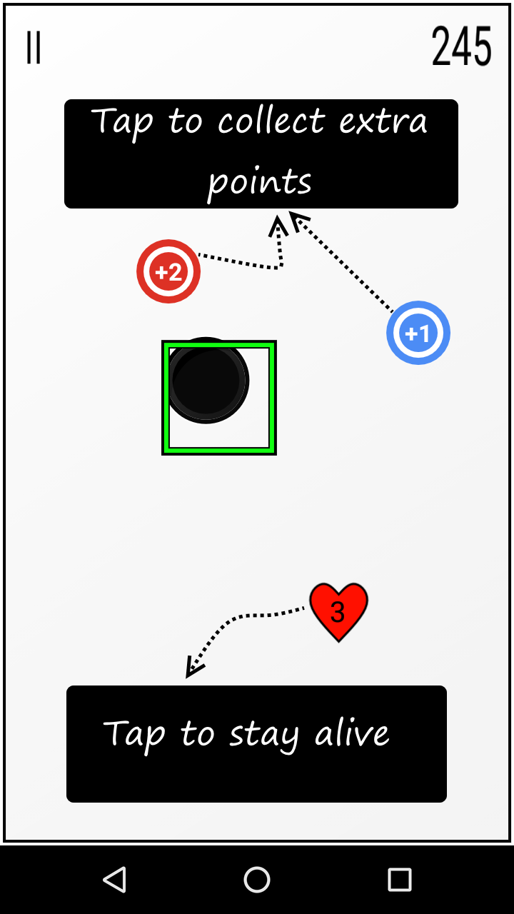
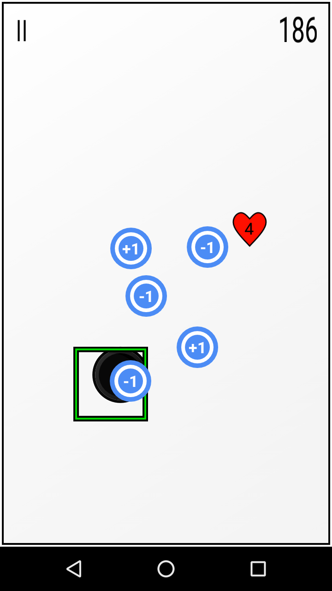
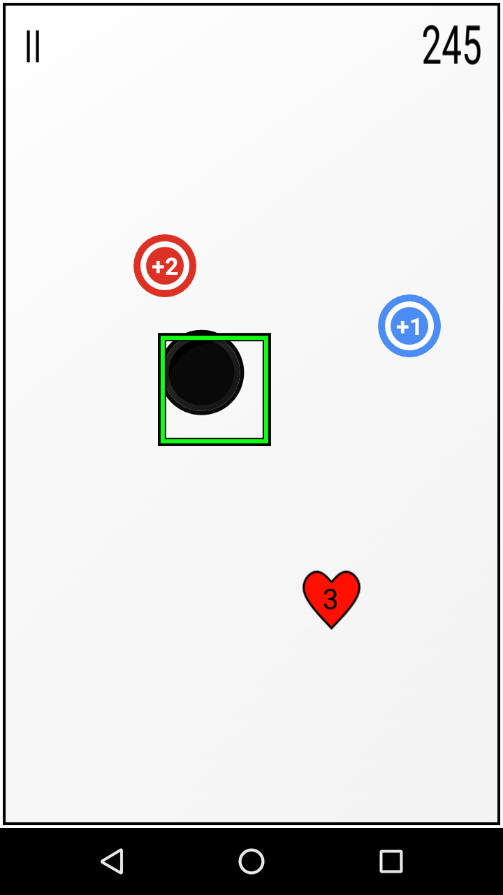

This is a motion senser game where you must focus on two things at one time to score high.
There is a box & there a ball.
The box follows a random path.
You have to control the ball by moving your phone.
You will die if the ball goes out of the box.
Things get interesting when you need to collect certain tokens by tapping on them to stay alive in the game.

Link to the game on play store : 
https://play.google.com/store/apps/details?id=com.archer.box_d_ball

This solution may be used a reference.

